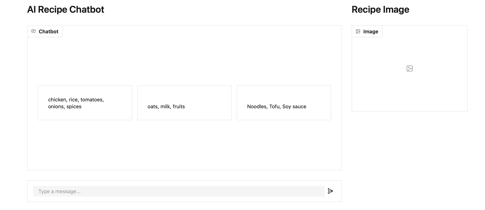
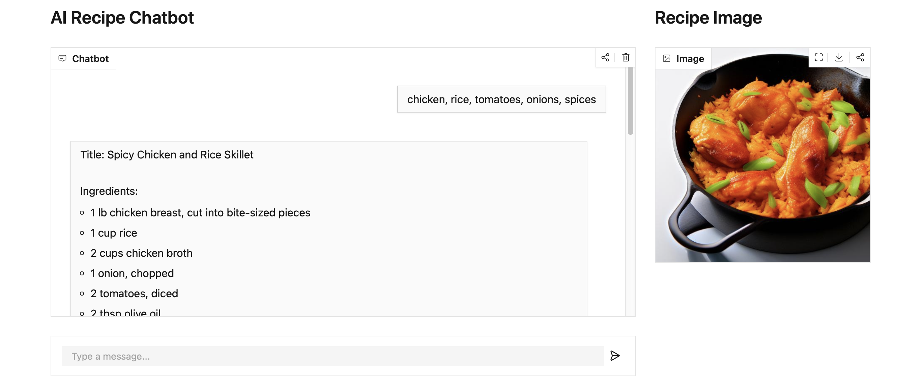
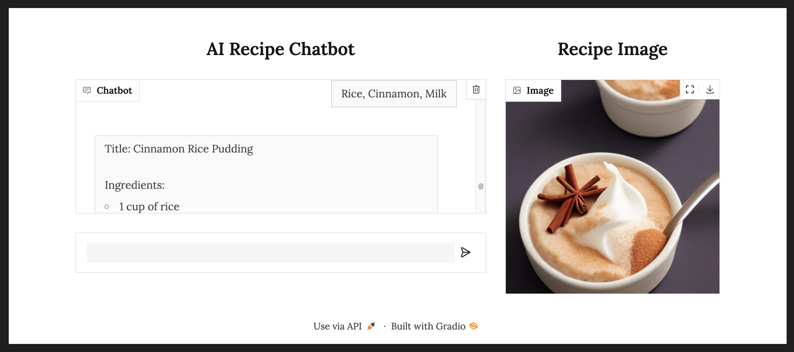
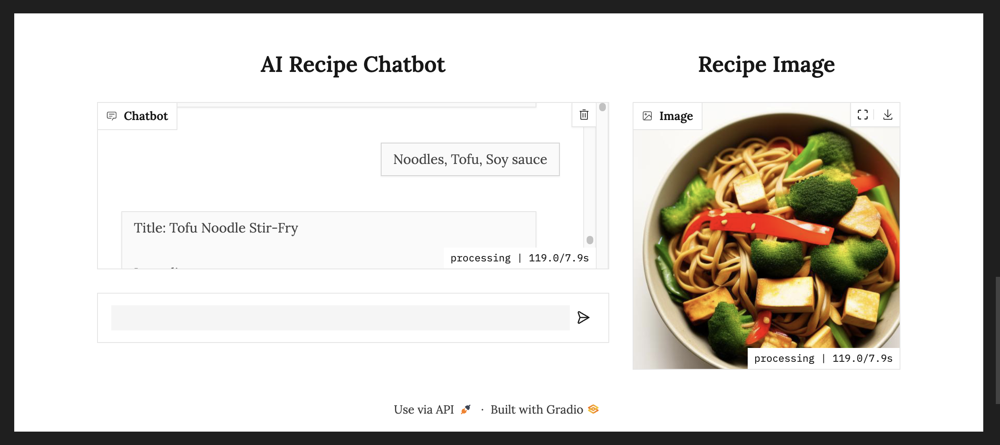

# User Guide: AI Recipe Chatbot Application

## Introduction
Welcome to the AI Recipe Chatbot Application! This innovative tool allows you to generate detailed recipes and accompanying images by simply providing a list of ingredients. The application uses state-of-the-art AI models for text and image generation, deployed on Hugging Face Spaces with a user-friendly interface built using Gradio.

---

## Getting Started

### 1. System Requirements
- **Operating System:** Windows/macOS/Linux
- **Python Version:** 3.8 or higher
- **Internet Connection:** Required for API requests

### 2. Installation and Setup
- Clone the application from the repository: `git clone https://github.com/joethi/SDS-CP017-ai-recipe-wizard.git`
- Navigate to the project directory: `cd notebooks/jothi-thondiraj`
- Install dependencies
- Set up your Hugging Face API token as an environment variable:
  ```bash
  export API_Token_HF_AIrecipe="your_huggingface_api_token"
  ```

### 3. Launching the Application
- Run the script to start the Gradio interface:
  ```bash
  python app.py
  ```
- Open your browser and go to the local server link displayed in the terminal (e.g., `http://127.0.0.1:7860`).

---

## Navigating the Interface

### 1. Chat Interface

- The main interaction point for users.
- Input ingredients separated by commas in the chat box to generate a recipe and its image.
- Click the ingredients displayed in the user interface to get started.
- Here is the image of how the user interface would look like:

    <!--  -->
    


### 2. Recipe Image Section
- Displays the generated recipe and the image once processing is complete.

### 3. Examples Section
- Provides pre-loaded ingredient examples to explore the application’s capabilities.
---

## Using the Application

### 1. Enter Ingredients
- Type or copy-paste the list of ingredients into the chat box.
- Example: `chicken, rice, tomatoes, onions, spices`

### 2. Generate Recipe and Image
- The chatbot will generate a detailed recipe, including a title, steps, and an image of the dish.

### 3. View Results
- The generated recipe text will appear in the chat interface.
- The recipe image will be displayed in the Recipe Image section.

### 3. Example Results
- For the ingredients: `chicken, rice, tomatoes, onions, spices`, here is the example output:

    

- For dessert lovers, given the ingredients: `cinnamon, rice, milk`, here is the example output:

       

- Finally, for vegans and vegetarians, here is the recipe with the ingredients: `tofu, noodles, soy sauce`

    


    
---

## Troubleshooting

### 1. Common Issues
- **No API Token:** Ensure the `API_Token_HF_AIrecipe` environment variable is set correctly.
- **Connection Error:** Check your internet connection.
- **Longer Wait Times** Since the models are currently limited to simple open source models, 
  the running time is a bit long sometimes. But it is worth the wait to see the delicious recipes!
  If you want to use the faster models such as OpenAI models, please look at the notebook: 
  `JothiThondiraj-AIRecipeWizard-openai.ipynb`

### 2. Error Messages
- **Error generating recipe:** Verify the Hugging Face model name and token.
- **Error generating image:** Ensure the image generation model is accessible.

---

## Tips for Best Results

1. Use detailed ingredient lists for more specific recipes.
2. Keep ingredient names simple to avoid confusion for the AI.
3. Experiment with the example inputs to explore variations.

---

## Want a ready-to-go app? we got your back use HuggingFace Spaces:

1. Visit the [Hugging face Spaces](https://huggingface.co/spaces). 
2. In the search bar, type `jothi3112/Chef_Jothi_AI_Magic` and enter to find my space.
3. Alternatively you can use the [Link](https://huggingface.co/spaces/jothi3112/Chef_Jothi_AI_Magic) to access the application.

---

## Feedback and Support

### 1. Feedback
- Use the feedback option in the application to report bugs or suggest features.

### 2. Contact Support
- Email: nasaaimer2014@gmail.com

---

Enjoy creating recipes with the power of AI!


